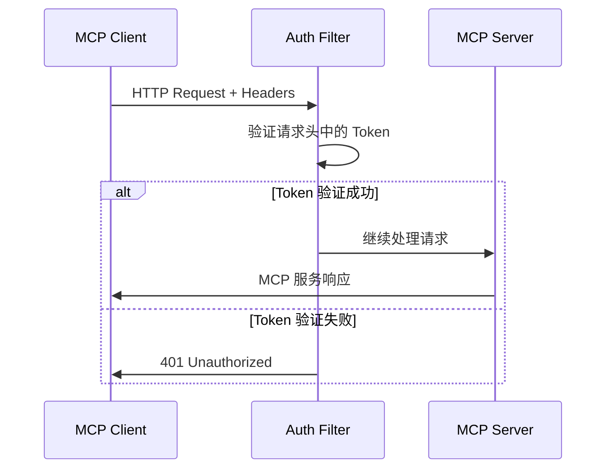

# Spring AI Alibaba MCP Authentication Example

## 项目介绍

Spring AI Alibaba MCP Authentication Example 展示了如何在企业环境中部署具有身份认证机制的 MCP (Model Context Protocol) 服务。本项目基于 Web 过滤器机制实现了对 MCP 客户端连接的身份验证，确保只有授权的客户端才能访问 MCP 服务器提供的工具和服务。

## 业务场景

在企业级应用中部署 MCP Server 服务时，安全性和访问控制是关键需求：

- **身份验证**: 确认连接的 MCP 客户端身份
- **访问控制**: 防止未授权的客户端访问服务
- **安全审计**: 记录所有访问尝试和认证结果
- **灵活配置**: 支持多种认证策略和环境配置

## 技术架构

### 认证流程



### 认证机制

本项目实现了基于 HTTP 请求头的简单认证机制：

1. **客户端认证**: 在请求头中添加认证 token
2. **服务器验证**: 通过过滤器检查请求头中的 token
3. **访问控制**: 验证通过的请求才能访问 MCP 服务
4. **安全拒绝**: 未认证请求返回 401 状态码

## 项目结构

```
spring-ai-alibaba-mcp-auth-example/
├── client/
│   └── mcp-auth-client/               # MCP 认证客户端
│       ├── src/main/java/com/alibaba/cloud/ai/mcp/client/
│       │   ├── AuthClientApplication.java
│       │   └── config/
│       │       ├── HeaderSyncHttpRequestCustomizer.java
│       │       └── HttpClientConfig.java
│       └── src/main/resources/
│           └── application.yml
├── server/
│   └── mcp-auth-web-server/           # MCP 认证服务器
│       ├── src/main/java/com/alibaba/cloud/ai/mcp/server/
│       │   ├── AuthWebServerApplication.java
│       │   ├── service/
│       │   │   └── TimeService.java
│       │   └── filter/
│       │       └── McpServerFilter.java
│       └── src/main/resources/
│           └── application.yml
├── pom.xml                            # 父级 POM 配置
└── README.md                          # 项目说明文档
```

## 核心组件

### 客户端组件

#### 1. HeaderSyncHttpRequestCustomizer
负责在所有 MCP 请求中自动添加认证头：
- **功能**: HTTP 请求头定制
- **用途**: 注入认证 token
- **灵活性**: 支持多个认证头配置

#### 2. HttpClientConfig
HTTP 客户端配置类：
- **配置**: 注册认证头定制器
- **管理**: 统一管理认证配置
- **扩展**: 支持多种认证策略

### 服务器组件

#### 1. McpServerFilter
认证过滤器：
- **拦截**: 拦截所有 MCP 请求
- **验证**: 检查请求头中的 token
- **决策**: 允许或拒绝访问
- **日志**: 记录认证过程

#### 2. TimeService
示例服务：
- **功能**: 提供时间查询工具
- **目的**: 演示 MCP 工具集成
- **安全**: 受认证过滤器保护

## 快速开始

### 1. 环境准备

#### 基础环境
- Java 17+
- Maven 3.6+

#### 环境变量
```bash
# 设置 DashScope API 密钥
export AI_DASHSCOPE_API_KEY=your_dashscope_api_key_here
```

### 2. 构建项目

```bash
# 进入项目根目录
cd spring-ai-alibaba-mcp-auth-example

# 构建整个项目
mvn clean package -DskipTests
```

### 3. 启动认证服务器

```bash
cd server/mcp-auth-web-server

# 启动服务器
mvn spring-boot:run
```

服务器将在 `http://localhost:20000` 启动，并启用认证机制。

### 4. 启动认证客户端

```bash
cd client/mcp-auth-client

# 启动客户端
mvn spring-boot:run
```

客户端将自动添加认证头并与服务器建立连接。

### 5. 验证认证流程

观察服务器日志，应该看到如下输出：

```
Header token-1: yingzi-1
Header token-2: yingzi-2
preHandle: 验证通过
preHandle: 请求的URL: http://localhost:20000/mcp
preHandle: 请求的TOKEN: yingzi-1
```

## 配置说明

### 默认认证配置

| 组件 | 配置项 | 默认值 | 说明 |
|------|--------|--------|------|
| 客户端 | 请求头 | `token-1: yingzi-1` | 主要认证头 |
| 客户端 | 请求头 | `token-2: yingzi-2` | 备用认证头 |
| 服务器 | 验证头 | `token-1` | 检查的请求头 |
| 服务器 | 验证值 | `yingzi-1` | 期望的 token 值 |

### 自定义配置

#### 客户端配置
在 `client/mcp-auth-client/src/main/java/.../HttpClientConfig.java` 中修改：

```java
@Bean
public McpSyncHttpClientRequestCustomizer mcpAsyncHttpClientRequestCustomizer() {
    Map<String, String> headers = new HashMap<>();
    headers.put("Authorization", "Bearer your-jwt-token");
    headers.put("X-API-Key", "your-api-key");

    return new HeaderSyncHttpRequestCustomizer(headers);
}
```

#### 服务器配置
在 `server/mcp-auth-web-server/src/main/java/.../McpServerFilter.java` 中修改：

```java
private static final String TOKEN_HEADER = "Authorization";
private static final String TOKEN_VALUE = "your-jwt-token";
```

## 使用示例

### 基本认证测试

使用 curl 测试认证机制：

```bash
# 正确认证
curl -H "token-1: yingzi-1" http://localhost:20000/mcp

# 错误认证
curl -H "token-1: wrong-token" http://localhost:20000/mcp
# 返回: 401 Unauthorized

# 无认证头
curl http://localhost:20000/mcp
# 返回: 401 Unauthorized
```

### 程序化认证测试

```java
// 创建带认证的 HTTP 客户端
WebClient client = WebClient.builder()
    .defaultHeader("token-1", "yingzi-1")
    .baseUrl("http://localhost:20000")
    .build();

// 测试认证
Mono<String> response = client.get()
    .uri("/mcp")
    .retrieve()
    .bodyToMono(String.class);
```

## 高级用法

### 1. JWT Token 认证

#### 客户端配置
```java
@Configuration
public class JwtAuthConfig {

    @Bean
    public McpSyncHttpClientRequestCustomizer jwtAuthCustomizer() {
        Map<String, String> headers = new HashMap<>();

        // 从环境变量获取 JWT
        String jwt = System.getenv("JWT_TOKEN");
        if (jwt != null) {
            headers.put("Authorization", "Bearer " + jwt);
        }

        return new HeaderSyncHttpRequestCustomizer(headers);
    }
}
```

#### 服务器配置
```java
@Component
public class McpServerFilter implements WebFilter {

    private final JwtTokenValidator jwtValidator;

    @Override
    public Mono<Void> filter(ServerWebExchange exchange, WebFilterChain chain) {
        HttpHeaders headers = exchange.getRequest().getHeaders();
        String authHeader = headers.getFirst("Authorization");

        if (authHeader != null && authHeader.startsWith("Bearer ")) {
            String jwt = authHeader.substring(7);
            return jwtValidator.validate(jwt)
                .flatMap(isValid -> {
                    if (isValid) {
                        return chain.filter(exchange);
                    } else {
                        return unauthorized(exchange);
                    }
                });
        }

        return unauthorized(exchange);
    }
}
```

### 2. API Key 认证

#### 客户端配置
```java
@Bean
public McpSyncHttpClientRequestCustomizer apiKeyAuthCustomizer() {
    Map<String, String> headers = new HashMap<>();

    String apiKey = environment.getProperty("api.key");
    if (apiKey != null) {
        headers.put("X-API-Key", apiKey);
    }

    return new HeaderSyncHttpRequestCustomizer(headers);
}
```

#### 服务器配置
```java
@Component
public class McpServerFilter implements WebFilter {

    private final Set<String> validApiKeys;

    public McpServerFilter() {
        this.validApiKeys = Set.of(
            System.getenv("API_KEY_1"),
            System.getenv("API_KEY_2")
        );
    }

    @Override
    public Mono<Void> filter(ServerWebExchange exchange, WebFilterChain chain) {
        HttpHeaders headers = exchange.getRequest().getHeaders();
        String apiKey = headers.getFirst("X-API-Key");

        if (apiKey != null && validApiKeys.contains(apiKey)) {
            return chain.filter(exchange);
        }

        return unauthorized(exchange);
    }
}
```

### 3. 多环境认证配置

#### 开发环境 (application-dev.yml)
```yaml
auth:
  tokens:
    - header: "token-1"
      value: "dev-token-1"
    - header: "X-Dev-Auth"
      value: "dev-secret"
```

#### 生产环境 (application-prod.yml)
```yaml
auth:
  tokens:
    - header: "Authorization"
      value: "${JWT_TOKEN}"
    - header: "X-API-Key"
      value: "${API_KEY}"
```

#### 环境配置类
```java
@Configuration
public class MultiEnvAuthConfig {

    @Bean
    @Profile("dev")
    public McpSyncHttpClientRequestCustomizer devAuthCustomizer() {
        Map<String, String> headers = new HashMap<>();
        headers.put("token-1", "dev-token-1");
        headers.put("X-Dev-Auth", "dev-secret");
        return new HeaderSyncHttpRequestCustomizer(headers);
    }

    @Bean
    @Profile("prod")
    public McpSyncHttpClientRequestCustomizer prodAuthCustomizer() {
        Map<String, String> headers = new HashMap<>();
        headers.put("Authorization", "Bearer " + System.getenv("JWT_TOKEN"));
        return new HeaderSyncHttpRequestCustomizer(headers);
    }
}
```

## 安全最佳实践

### 1. Token 管理

- **环境变量**: 使用环境变量存储敏感 token
- **配置加密**: 对配置文件中的敏感信息进行加密
- **定期轮换**: 定期更新认证 token
- **访问控制**: 限制对 token 配置的访问权限

### 2. 生产环境建议

```yaml
# 生产环境配置示例
spring:
  profiles:
    active: prod

# 认证配置
auth:
  jwt:
    secret: ${JWT_SECRET}
    expiration: ${JWT_EXPIRATION:3600}
  api-keys:
    - ${API_KEY_1}
    - ${API_KEY_2}

# 日志配置
logging:
  level:
    com.alibaba.cloud.ai.mcp.server.filter: INFO
    # 避免在生产环境中打印敏感信息
    root: WARN
```

### 3. 监控和审计

```java
@Component
public class AuthMetrics {

    private final MeterRegistry meterRegistry;
    private final Counter authSuccessCounter;
    private final Counter authFailureCounter;

    public AuthMetrics(MeterRegistry meterRegistry) {
        this.meterRegistry = meterRegistry;
        this.authSuccessCounter = Counter.builder("auth.success")
            .description("Successful authentications")
            .register(meterRegistry);
        this.authFailureCounter = Counter.builder("auth.failure")
            .description("Failed authentications")
            .register(meterRegistry);
    }

    public void recordSuccess() {
        authSuccessCounter.increment();
    }

    public void recordFailure() {
        authFailureCounter.increment();
    }
}
```

## 故障排除

### 常见问题

1. **认证失败 (401 Unauthorized)**
   ```
   原因: Token 不匹配或缺失
   解决:
   - 检查客户端配置的 token 值
   - 验证服务器端的验证逻辑
   - 查看服务器日志确认 token 验证过程
   ```

2. **请求头未添加**
   ```
   原因: 客户端认证配置未生效
   解决:
   - 确认 HeaderSyncHttpRequestCustomizer 已正确注册
   - 检查 HttpClientConfig 的 @Bean 注解
   - 验证 Spring Boot 是否扫描到配置类
   ```

3. **过滤器不工作**
   ```
   原因: 服务器端过滤器配置问题
   解决:
   - 确认 @Component 注解存在
   - 检查过滤器的执行顺序
   - 验证请求路径是否匹配过滤条件
   ```

### 调试配置

启用详细日志：

```yaml
logging:
  level:
    com.alibaba.cloud.ai.mcp.client: DEBUG
    com.alibaba.cloud.ai.mcp.client.config: DEBUG
    com.alibaba.cloud.ai.mcp.server.filter: DEBUG
    io.modelcontextprotocol.client: DEBUG
    org.springframework.web.server: DEBUG
```

### 测试工具

#### 认证测试脚本
```bash
#!/bin/bash

echo "=== MCP 认证测试 ==="

# 服务器地址
SERVER_URL="http://localhost:20000/mcp"

echo "1. 测试正确认证"
curl -v -H "token-1: yingzi-1" $SERVER_URL

echo -e "\n\n2. 测试错误认证"
curl -v -H "token-1: wrong-token" $SERVER_URL

echo -e "\n\n3. 测试无认证头"
curl -v $SERVER_URL

echo -e "\n\n4. 测试额外认证头"
curl -v -H "token-1: yingzi-1" -H "token-2: yingzi-2" $SERVER_URL
```

## 扩展开发

### 1. 认证策略接口

```java
public interface AuthenticationStrategy {
    Mono<Boolean> authenticate(HttpHeaders headers);
    String getStrategyName();
}
```

### 2. 组合认证策略

```java
@Component
public class CompositeAuthFilter implements WebFilter {

    private final List<AuthenticationStrategy> strategies;

    @Override
    public Mono<Void> filter(ServerWebExchange exchange, WebFilterChain chain) {
        HttpHeaders headers = exchange.getRequest().getHeaders();

        return Flux.fromIterable(strategies)
            .flatMap(strategy ->
                strategy.authenticate(headers)
                    .doOnSuccess(success -> {
                        if (success) {
                            logger.info("Authentication successful with strategy: {}",
                                strategy.getStrategyName());
                        }
                    })
            )
            .filter(Boolean::booleanValue)
            .hasElements()
            .flatMap(hasValidAuth -> {
                if (hasValidAuth) {
                    return chain.filter(exchange);
                } else {
                    return unauthorized(exchange);
                }
            });
    }
}
```

### 3. 动态认证配置

```java
@RestController
@RequestMapping("/auth")
public class AuthConfigController {

    private final AuthConfigManager configManager;

    @PostMapping("/tokens")
    public ResponseEntity<?> addToken(@RequestBody TokenConfig config) {
        configManager.addToken(config);
        return ResponseEntity.ok().build();
    }

    @DeleteMapping("/tokens/{tokenId}")
    public ResponseEntity<?> removeToken(@PathVariable String tokenId) {
        configManager.removeToken(tokenId);
        return ResponseEntity.ok().build();
    }

    @GetMapping("/tokens")
    public ResponseEntity<List<TokenConfig>> getTokens() {
        return ResponseEntity.ok(configManager.getAllTokens());
    }
}
```

## 相关文档

- [Spring AI Alibaba 官方文档](https://github.com/alibaba/spring-ai-alibaba)
- [Model Context Protocol 规范](https://modelcontextprotocol.io/)
- [Spring WebFlux 文档](https://docs.spring.io/spring-framework/docs/current/reference/html/web-reactive.html)
- [Spring Security 参考指南](https://docs.spring.io/spring-security/reference/)
- [JWT 规范 (RFC 7519)](https://tools.ietf.org/html/rfc7519)
- [HTTP 认证最佳实践](https://tools.ietf.org/html/rfc7235)

## 许可证

本项目采用 Apache License 2.0 许可证。详情请参阅 [LICENSE](../../../LICENSE) 文件。